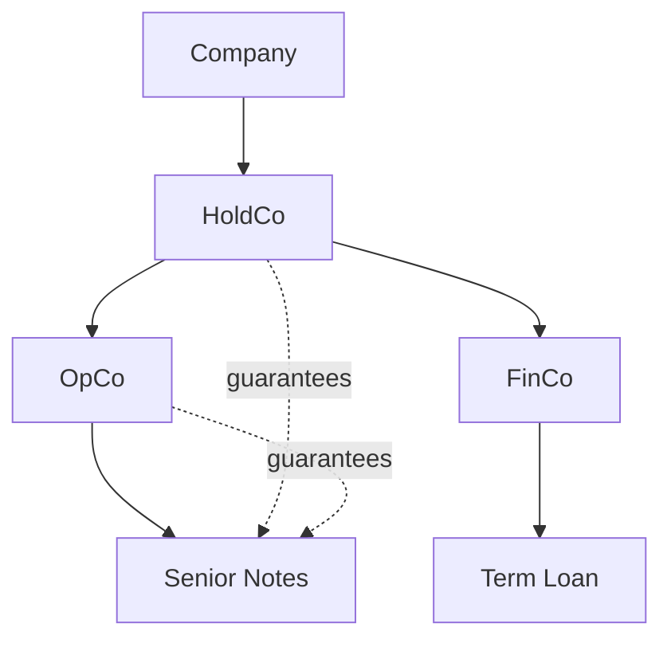

## Overview

DebtStack extracts and structures corporate debt data from SEC filings. The data is organized around companies, entities, debt instruments, and their relationships.

## Core Objects

### Company

The top-level object representing a publicly traded company.

```json
{
  "ticker": "CHTR",
  "name": "Charter Communications, Inc.",
  "cik": "1091667",
  "sector": "Communication Services",
  "industry": "Cable & Satellite",
  "total_debt": 9500000000000,
  "net_leverage_ratio": 4.5
}
```

### Entity

A legal entity within the corporate structure (subsidiaries, holding companies, operating companies).

```json
{
  "id": "uuid-123",
  "name": "CCO Holdings, LLC",
  "entity_type": "opco",
  "jurisdiction": "Delaware",
  "parent_id": "uuid-000",
  "is_guarantor": true,
  "is_restricted_subsidiary": true
}
```

**Entity Types:**
- `holdco` - Holding company (typically top-level)
- `opco` - Operating company
- `finco` - Financing subsidiary
- `subsidiary` - General subsidiary
- `jv` - Joint venture
- `vie` - Variable interest entity

### Debt Instrument

A specific debt obligation (bond, loan, credit facility).

```json
{
  "id": "uuid-456",
  "name": "5.75% Senior Notes due 2028",
  "issuer_id": "uuid-123",
  "instrument_type": "senior_notes",
  "seniority": "senior_unsecured",
  "principal": 150000000000,
  "outstanding": 150000000000,
  "coupon_rate": 5.75,
  "rate_type": "fixed",
  "maturity_date": "2028-01-15",
  "currency": "USD"
}
```

**Seniority Levels:**
- `senior_secured` - First priority claim
- `senior_unsecured` - Unsecured senior debt
- `subordinated` - Junior to senior debt

**Instrument Types:**
- `senior_notes` - Fixed-rate bonds
- `term_loan_a` - Amortizing term loan
- `term_loan_b` - Bullet term loan
- `revolver` - Revolving credit facility
- `first_lien` - First lien secured loan
- `second_lien` - Second lien secured loan

### Guarantee

A relationship where one entity guarantees another entity's debt.

```json
{
  "debt_instrument_id": "uuid-456",
  "guarantor_id": "uuid-789",
  "guarantee_type": "full_and_unconditional"
}
```

### Collateral

Assets pledged to secure debt instruments.

```json
{
  "debt_instrument_id": "uuid-456",
  "collateral_type": "real_estate",
  "description": "First mortgage on headquarters building",
  "priority": 1
}
```

**Collateral Types:**
- `real_estate` - Property and buildings
- `equipment` - Machinery, vehicles
- `receivables` - Accounts receivable
- `inventory` - Stock and goods
- `ip` - Intellectual property, patents
- `securities` - Stock pledges
- `general_lien` - Blanket lien on assets
- `vehicles` - Aircraft, ships, cars
- `energy_assets` - Oil/gas reserves

## Data Conventions

### Monetary Values

All monetary values are stored in **cents** (hundredths of a dollar) to avoid floating-point precision issues.

| Value | Cents |
|-------|-------|
| $1.00 | 100 |
| $1 million | 100,000,000 |
| $1 billion | 100,000,000,000 |

Example: `total_debt: 9500000000000` = $95 billion

### Interest Rates

Interest rates are stored as **percentages** (not basis points) for readability.

| Value | Storage |
|-------|---------|
| 5.75% | 5.75 |
| 8.50% | 8.50 |
| SOFR + 200bps | spread_bps: 200 |

### Dates

All dates use **ISO 8601** format: `YYYY-MM-DD`

```json
{
  "issue_date": "2023-01-15",
  "maturity_date": "2028-01-15"
}
```

## Relationships



- A **Company** has many **Entities**
- An **Entity** can issue **Debt Instruments**
- An **Entity** can guarantee other entities' **Debt Instruments**
- A **Debt Instrument** can have multiple **Guarantors**
- A **Debt Instrument** can have **Collateral**

## Document Sections

SEC filings are parsed into searchable sections:

| Section Type | Description | Source |
|--------------|-------------|--------|
| `exhibit_21` | Subsidiary list | 10-K Exhibit 21 |
| `debt_footnote` | Long-term debt details | 10-K/10-Q Notes |
| `mda_liquidity` | Liquidity discussion | MD&A |
| `credit_agreement` | Full credit facilities | 8-K Exhibit 10 |
| `indenture` | Bond indentures | 8-K Exhibit 4 |
| `guarantor_list` | Guarantor subsidiaries | Notes |
| `covenants` | Financial covenants | Notes/Exhibits |

## Coverage

211 companies covering S&P 100 and NASDAQ 100, with thousands of debt instruments, real-time bond pricing from FINRA TRACE, and searchable SEC filing sections. Expanding to 500+ companies.
