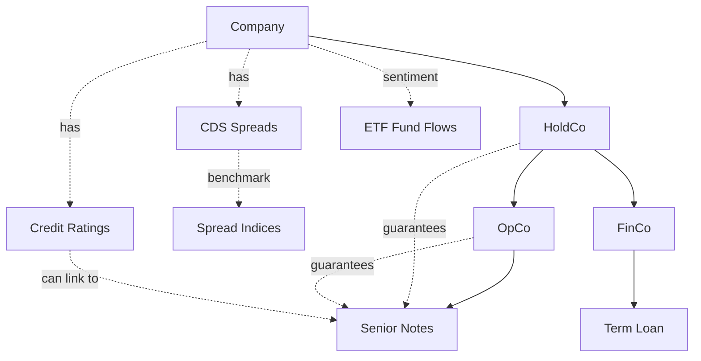

## Overview

DebtStack extracts and structures corporate debt data from SEC filings. The data is organized around companies, entities, debt instruments, credit ratings, market data, and their relationships.

## Core Objects

### Company

The top-level object representing a publicly traded company.

```json
{
  "ticker": "CHTR",
  "name": "Charter Communications, Inc.",
  "cik": "1091667",
  "sector": "Communication Services",
  "industry": "Cable & Satellite",
  "total_debt": 9500000000000,
  "net_leverage_ratio": 4.5
}
```

### Entity

A legal entity within the corporate structure (subsidiaries, holding companies, operating companies).

```json
{
  "id": "uuid-123",
  "name": "CCO Holdings, LLC",
  "entity_type": "opco",
  "jurisdiction": "Delaware",
  "parent_id": "uuid-000",
  "is_guarantor": true,
  "is_restricted_subsidiary": true
}
```

**Entity Types:**
- `holdco` - Holding company (typically top-level)
- `opco` - Operating company
- `finco` - Financing subsidiary
- `subsidiary` - General subsidiary
- `jv` - Joint venture
- `vie` - Variable interest entity

### Debt Instrument

A specific debt obligation (bond, loan, credit facility).

```json
{
  "id": "uuid-456",
  "name": "5.75% Senior Notes due 2028",
  "issuer_id": "uuid-123",
  "instrument_type": "senior_notes",
  "seniority": "senior_unsecured",
  "principal": 150000000000,
  "outstanding": 150000000000,
  "coupon_rate": 5.75,
  "rate_type": "fixed",
  "maturity_date": "2028-01-15",
  "currency": "USD"
}
```

**Seniority Levels:**
- `senior_secured` - First priority claim
- `senior_unsecured` - Unsecured senior debt
- `subordinated` - Junior to senior debt

**Instrument Types:**
- `senior_notes` - Fixed-rate bonds
- `term_loan_a` - Amortizing term loan
- `term_loan_b` - Bullet term loan
- `revolver` - Revolving credit facility
- `first_lien` - First lien secured loan
- `second_lien` - Second lien secured loan

### Guarantee

A relationship where one entity guarantees another entity's debt.

```json
{
  "debt_instrument_id": "uuid-456",
  "guarantor_id": "uuid-789",
  "guarantee_type": "full_and_unconditional"
}
```

### Collateral

Assets pledged to secure debt instruments.

```json
{
  "debt_instrument_id": "uuid-456",
  "collateral_type": "real_estate",
  "description": "First mortgage on headquarters building",
  "priority": 1
}
```

**Collateral Types:**
- `real_estate` - Property and buildings
- `equipment` - Machinery, vehicles
- `receivables` - Accounts receivable
- `inventory` - Stock and goods
- `ip` - Intellectual property, patents
- `securities` - Stock pledges
- `general_lien` - Blanket lien on assets
- `vehicles` - Aircraft, ships, cars
- `energy_assets` - Oil/gas reserves

### Credit Rating

A credit rating from S&P, Moody's, or Fitch. Ratings exist at both the issuer level (overall creditworthiness) and instrument level (specific debt obligation).

```json
{
  "ticker": "CHTR",
  "company_name": "Charter Communications, Inc.",
  "agency": "sp",
  "rating": "BB+",
  "rating_type": "issuer",
  "rating_bucket": "HY-BB",
  "outlook": "stable",
  "effective_date": "2024-08-15",
  "source_section_type": "nrsro_17g7"
}
```

**Rating Types:**
- `issuer` — Overall issuer creditworthiness (headline rating)
- `senior_secured` — Secured debt rating (often notched up from issuer)
- `senior_unsecured` — Unsecured debt rating
- `subordinated` — Junior debt rating (notched down from issuer)
- `corporate_family` — Moody's Corporate Family Rating (probability of default)

**Rating Buckets:**
- `IG` — Investment grade (BBB-/Baa3 and above)
- `HY-BB` — Upper high yield (BB+ to BB-)
- `HY-B` — Mid high yield (B+ to B-)
- `HY-CCC` — Distressed (CCC+ and below)
- `NR` — Not rated

**Agencies:** `sp` (S&P), `moodys` (Moody's), `fitch` (Fitch)

**Sources:** `nrsro_17g7` (SEC Rule 17g-7(b) regulatory disclosures), `llm_extraction` (extracted from SEC filings)

Instrument-level ratings include `debt_instrument_id`, `instrument_name`, and `cusip` linking to the specific debt obligation.

See the [Ratings endpoint](/api-reference/ratings/search) for details.

### CDS Spread

Credit default swap spread time series, derived from bond spread-to-treasury pricing. Economically equivalent to CDS spreads (CDS-bond basis is typically within 20 bps for investment grade).

```json
{
  "ticker": "CHTR",
  "company_name": "Charter Communications, Inc.",
  "spread_date": "2026-03-04",
  "tenor": "5Y",
  "spread_bps": 185.3,
  "trade_count": 8,
  "bond_count": 5,
  "source": "bond_spread_proxy"
}
```

**Tenors:** `1Y`, `3Y`, `5Y`, `7Y`, `10Y`

**Fields:**
- `spread_bps` — Median spread to treasury in basis points
- `trade_count` — Number of TRACE trades underlying the computation
- `bond_count` — Number of distinct bonds in the tenor bucket
- `source` — Data source (`bond_spread_proxy`)

Negative spreads are possible for premium investment grade issuers (floor: -200 bps).

See the [CDS Spreads endpoint](/api-reference/market/cds) for details.

### ETF Fund Flow

Estimated daily fund flows for credit-focused ETFs, derived from changes in shares outstanding multiplied by NAV. The strongest short-term predictor of credit spread direction.

```json
{
  "flow_date": "2026-03-18",
  "etf_ticker": "HYG",
  "asset_class": "hy",
  "shares_outstanding": 245000000,
  "nav_per_share": 74.25,
  "estimated_flow_usd": -180000000,
  "cumulative_flow_usd": -1200000000,
  "source": "yahoo_finance"
}
```

**Asset Classes:** `ig` (Investment Grade), `hy` (High Yield), `leveraged_loan`, `em_bond` (Emerging Markets), `broad`

**Tracked ETFs:** LQD, VCIT, VCSH, USIG (IG); HYG, JNK, SHYG (HY); BND (Broad); EMB (EM); SRLN (Leveraged Loans)

See the [ETF Fund Flows endpoint](/api-reference/market/flows) for details.

### Credit Spread Index

ICE BofA option-adjusted spread (OAS) indices from FRED. Daily benchmark spreads across rating buckets and maturities.

```json
{
  "observation_date": "2026-03-18",
  "series_id": "BAMLC0A0CM",
  "spread_bps": 95,
  "index_name": "IG Corporate OAS",
  "index_category": "broad",
  "source": "fred"
}
```

**Categories:** `broad` (IG/HY aggregate), `rating` (AAA through CCC), `maturity` (IG 1-3Y, 3-5Y, 5-7Y, 7-10Y)

**Series:** 13 ICE BofA OAS indices updated daily at 6:30 PM ET.

See the [Credit Spread Indices endpoint](/api-reference/market/spreads) for details.

## Data Conventions

### Monetary Values

All monetary values are stored in **cents** (hundredths of a dollar) to avoid floating-point precision issues.

| Value | Cents |
|-------|-------|
| $1.00 | 100 |
| $1 million | 100,000,000 |
| $1 billion | 100,000,000,000 |

Example: `total_debt: 9500000000000` = $95 billion

### Interest Rates

Interest rates are stored as **percentages** (not basis points) for readability.

| Value | Storage |
|-------|---------|
| 5.75% | 5.75 |
| 8.50% | 8.50 |
| SOFR + 200bps | spread_bps: 200 |

### Dates

All dates use **ISO 8601** format: `YYYY-MM-DD`

```json
{
  "issue_date": "2023-01-15",
  "maturity_date": "2028-01-15"
}
```

## Relationships


```mermaid
graph TD
    Company[Company] --> Entity1[HoldCo]
    Company -.->|has| Ratings[Credit Ratings]
    Company -.->|has| CDS[CDS Spreads]
    CDS -.->|benchmark| Indices[Spread Indices]
    Company -.->|sentiment| Flows[ETF Fund Flows]
    Entity1 --> Entity2[OpCo]
    Entity1 --> Entity3[FinCo]
    Entity2 --> Debt1[Senior Notes]
    Entity3 --> Debt2[Term Loan]
    Entity1 -.->|guarantees| Debt1
    Entity2 -.->|guarantees| Debt1
    Ratings -.->|can link to| Debt1
```

- A **Company** has many **Entities**
- An **Entity** can issue **Debt Instruments**
- An **Entity** can guarantee other entities' **Debt Instruments**
- A **Debt Instrument** can have multiple **Guarantors**
- A **Debt Instrument** can have **Collateral**
- A **Company** has **Credit Ratings** (issuer-level from S&P, Moody's, Fitch)
- A **Credit Rating** can link to a specific **Debt Instrument** (instrument-level ratings)
- A **Company** has **CDS Spreads** (daily time series across 5 tenors)
- **ETF Fund Flows** track credit market sentiment across asset classes
- **Credit Spread Indices** provide market-wide benchmarks by rating and maturity

## Document Sections

SEC filings are parsed into searchable sections:

| Section Type | Description | Source |
|--------------|-------------|--------|
| `exhibit_21` | Subsidiary list | 10-K Exhibit 21 |
| `debt_footnote` | Long-term debt details | 10-K/10-Q Notes |
| `mda_liquidity` | Liquidity discussion | MD&A |
| `credit_agreement` | Full credit facilities | 8-K Exhibit 10 |
| `indenture` | Bond indentures | 8-K Exhibit 4 |
| `guarantor_list` | Guarantor subsidiaries | Notes |
| `covenants` | Financial covenants | Notes/Exhibits |

Sections support three search modes:
- **Keyword search** — PostgreSQL full-text search with relevance ranking
- **Semantic search** — Each section is split into overlapping chunks and embedded with Gemini (`gemini-embedding-001`, 768 dimensions). Queries are embedded and matched via cosine similarity, enabling natural language questions like "can they pay dividends" to find covenant language about restricted payments.
- **Hybrid search** — Combines both via Reciprocal Rank Fusion for comprehensive results

See the [Documents Search endpoint](/api-reference/documents/search) for details.

## Coverage

457 companies covering S&P 100, NASDAQ 100, and broader S&P 500, with 8,600+ debt instruments, 846 credit ratings across 367 companies, CDS spread time series (111 companies), ETF fund flows (10 credit ETFs), 13 ICE BofA spread indices, real-time bond pricing from FINRA TRACE, and searchable SEC filing sections.
